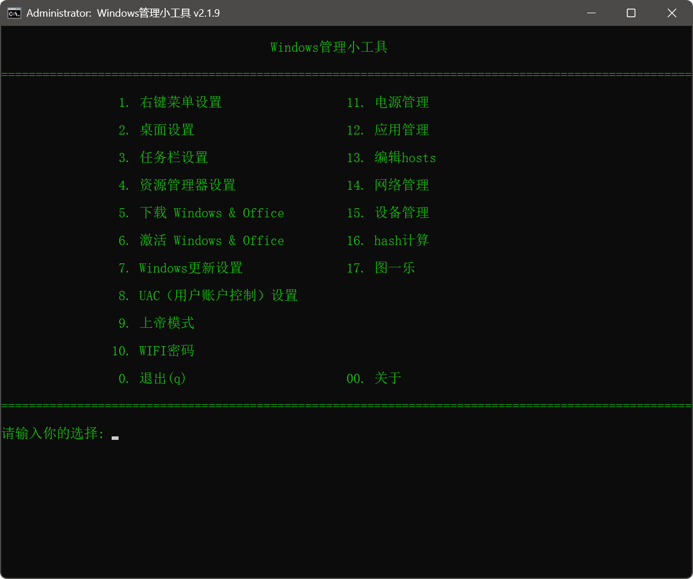

# Windows 管理小工具

这是一个功能丰富的批处理脚本，集成了多个 Windows 系统管理与优化工具，旨在简化日常维护和系统设置操作。支持中文界面，操作简洁直观。

## 🚀 功能列表

| 功能编号  | 描述                     |
|-------|------------------------|
| 1     | 🖱️ 右键菜单设置             |
| 2     | 🖥️ 桌面设置               |
| 3     | 📌 任务栏设置               |
| 4     | 📂 资源管理器设置             |
| 5     | 📦 安装 Microsoft Office |
| 6     | ✅ 激活 Windows & Office  |
| 7     | 🌐 下载 Windows 系统镜像     |
| 8     | 🔄 Windows 更新设置        |
| 9     | 🛡️ UAC（用户账户控制）设置      |
| 10    | 🧙 上帝模式启用              |
| 11    | 📶 查看 WIFI 密码          |
| 12    | 🔋 电源管理配置              |
| 13    | 🧹 预装应用管理              |
| 14    | ✏️ 编辑hosts             |
| 15    | 📡 Telnet功能            |
| 16    | 😄 图一乐（娱乐功能）           |
| 0 / q | ❌ 退出程序                 |

---

## 💻 运行效果

## 📦 使用说明

1. **双击Windows管理小工具.bat运行**  
   因为工具的很多功能需要管理员权限，所以在脚本的开头默认使用了管理员来运行脚本，无需手动管理员运行。

2. **操作方式**  
   启动后根据提示输入功能编号，即可进入对应模块进行设置或操作。

3. **系统兼容性**  
   - Windows 11 测试通过 。Windows 10未经过完全测试，需要谨慎使用。
   - 建议使用简体中文系统，以确保字符显示正常

---

## 📝 注意事项

- 请在使用前备份重要系统数据。
- 本工具涉及系统设置更改，请确保明白各项操作后再进行使用。
- 可能会被部分杀毒软件误报为修改工具，请放心使用。

## ⚠️ 免责声明

  本工具仅供学习和研究使用，作者不对使用本工具造成的任何后果负责。请在使用前备份重要数据。